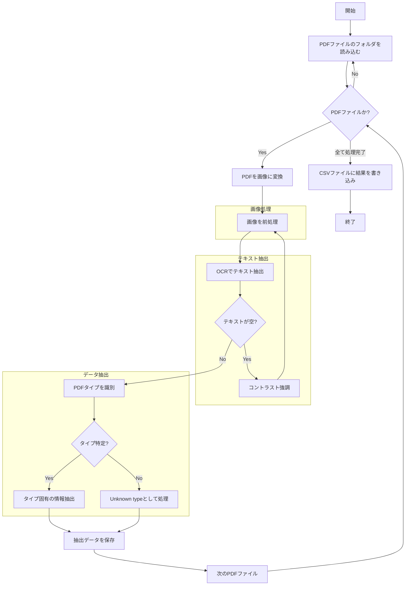

# What

中身が画像の PDF のテキスト抽出ツールです。(macOS 専用)

# Prerequisites

- Python 3.12 or later
- tesseract-lang: OCR 識別ライブラリの日本語対応のために必要です。
  - `brew install tesseract-lang`
- poppler: pdf2image ライブラリが依存している poppler
  - `brew install poppler`

# Getting Started

- 0. Put PDF files in the `Data` directory OR change the `pdf_path` variable in `main.py` to the path of the PDF file you want to extract.
- 1. install
  - `pip install -r requirements.txt`
- 2. run
  - `python main.py`

# Process Flow

